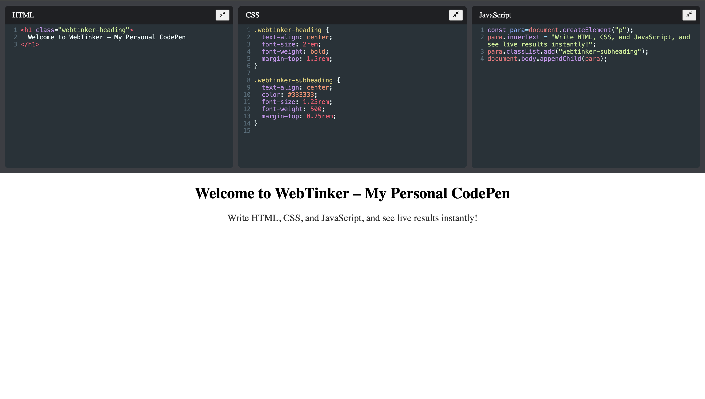

# WebTinker - My Personal CodePen Clone

**WebTinker** is a personal online code editor built with **React** and **CodeMirror**, allowing users to write **HTML, CSS, and JavaScript** and see live results instantly — just like CodePen.

---

## Features

- Three code editors for **HTML**, **CSS**, and **JavaScript**
- Live preview in an **iframe**
- Collapse/expand individual editors
- Debounced updates for smooth performance
- Responsive layout using **CSS Grid** and **Flexbox**
- Persistent code using `localStorage`

---

## Tech Stack

- **React** – Frontend UI library
- **CodeMirror** – Code editor
- **CSS** – Styling and layout

---

## Demo




---

## Installation

1. Clone the repository :

```bash 
git clone https://github.com/yourusername/WebTinker.git
cd WebTinker
```

2. Install Dependencies : 

```bash 
npm install
```

3. Start the development server :
```bash 
npm start
```
